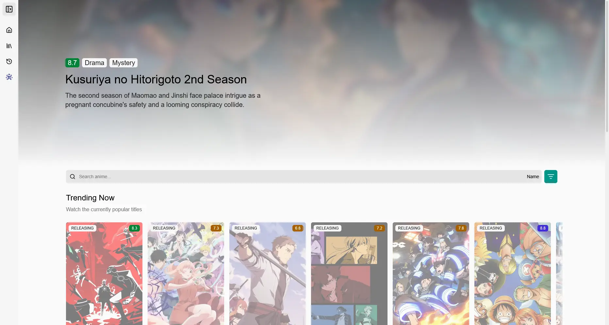
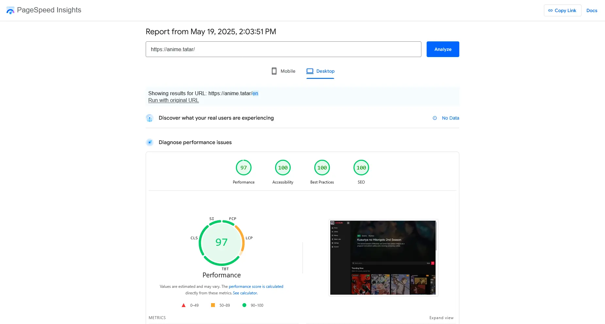

# [anisun (rebooted)](https://anime.tatar)

A web app for watching anime built with next.js

<strong>English</strong> | <a href="https://github.com/notwindstone/anisun/blob/main/README_russian.md">Русский</a>

## 📱 Screenshots

### More screenshots

Expand

## ⚡ Performance

* Using as few libraries as possible
* React Suspense for the seamless UI streaming
* Data caching both on the server (using [LRU cache](https://www.npmjs.com/package/quick-lru) & Next.js internal cache) and client
* User config management using cookies for the instant config load
* Preferring CSS over JS styles
* Memoizing only those components that truly need it
* Using Server Actions instead of API routes when possible
* Image optimization (built-in [sharp](https://www.npmjs.com/package/sharp) & specified properties) and caching for the home page
* Sidebar & mobile navbar routes prefetching 

...and a lot of other optimizations

### PageSpeed Insights

Expand

### Web page size

Expand

## ⭐ should be the features in the future

* Seamless Anilist, Shikimori and MAL integration
* Kodik, Anilibria, Sovetromantica, Consumet APIs for the media streaming
* Localization

## ⚙️ Tech Stack

* [Next.js 15](https://nextjs.org/) with [TypeScript](https://www.typescriptlang.org/)
* [TailwindCSS](https://tailwindcss.com/) for the UI
* An async state management using [Tanstack Query](https://tanstack.com/query/latest)
* [Mantine Hooks](https://mantine.dev/hooks/package/) for general usage on the frontend
* Fetching the data from Kodik (an anime media database) thanks to [KodikWrapper](https://github.com/thedvxchsquad/kodikwrapper)
* A video player based on [Vidstack.js](https://www.vidstack.io/) and [HLS.js](https://github.com/video-dev/hls.js)
* [Quick LRU](https://www.npmjs.com/package/quick-lru) for the in-memory cache

## ⬇️ Self-Hosting

### Local

#### Preparations

#### Development

#### Production

running this app with `bun run build` & `bun run start` is not enough.

You need to install a reverse-proxy like Caddy.

#### Website URL

### Vercel

### Termux

## 💬 Contact

### Directly

* [Telegram - @windst1](https://t.me/windst1)

* [Discord - @notwindstone](https://discord.com/users/510709295814279168)

### Through our Discord server

* [Discord - department of type safety](https://discord.gg/JhmkZDScfg)

## 🤝 Contributing

Contributions are welcome!

## ⭐️ Star History

## ❤️ Credits

## 📜 License

## ❗ Disclaimer

> [!IMPORTANT]
> Anisun does not host any files, it merely links to 3rd party services.
> Legal issues should be taken up with the file hosts and providers.
> Anisun is not responsible for any media files shown by the video providers.

> [!IMPORTANT]
> Work in progress...

credits for logo

https://x.com/ahiru_tokotoko/status/1568517301737242625

## To-Do

* Shikimori, MAL and AniList integrations
* Next.js 15 for frontend
* Rewrite everything
* more

https://github.com/consumet/api.consumet.org
