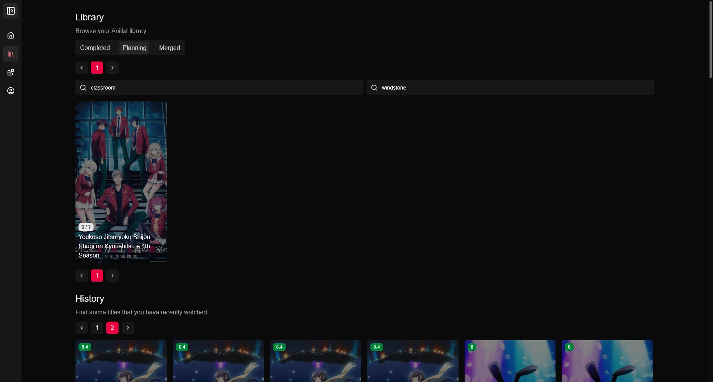
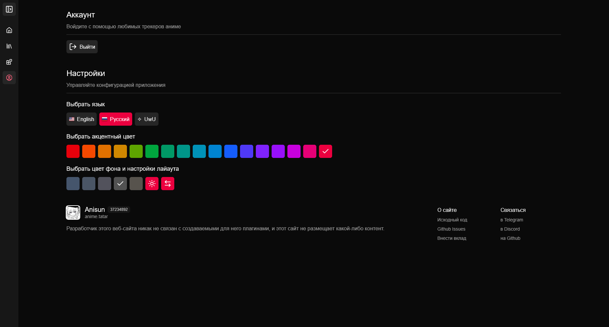

<div align="center">


# [anisun](https://anime.tatar)

**A web app for exploring anime with extensions support**

The initial goal of this project was to replicate a Tachiyomi-like experience for watching anime on a website.

<p align="center">
<strong>English</strong> | <a href="https://github.com/notwindstone/anisun/blob/main/docs/README_russian.md">Русский</a>
</p>

[![stars-badge]](https://github.com/notwindstone/anisun/stargazers)
[![next-js-badge]](https://nextjs.org/)
[![typescript-badge]](https://www.typescriptlang.org/)

</div>

## Screenshots

<div align="center">
    
    
    
    
</div>

### More

<details>
<summary>Expand</summary>

<div align="center">
    
    
    
    
    
    
    
</div>

</details>

## Features

* Extensions in JS (visit [docs.anime.tatar](https://docs.anime.tatar/) for more info)
* Anilist integration (and Shikimori in the future)
* Searching anime by filters
* Watching history
* Localization
* Theme customization

## Performance

Even though this website is written in React, I think I still managed to achieve adequate performance. I tried to make it as smooth as possible while dealing with the monstrous re-rendering nature of React. It should work perfectly on not powerful mobile phones too, both in Firefox and Chromium-based browsers.

### PageSpeed Insights

<details>
<summary>Expand</summary>

<div align="center">

![psi-home]

![psi-library]

![psi-extensions]

![psi-account]

</div>

</details>

### Web page size

<details>
<summary>Expand</summary>

<div align="center">

![web-page-size]

</div>

</details>

## Self-Hosting

### Vercel

<details>
<summary>Expand steps</summary>

Click the button

[](https://vercel.com/new/clone?s=https%3A%2F%2Fgithub.com%2Fnotwindstone%2Fanisun)

Navigate to **Project** -> **Settings** -> **Environment Variables** and then add values to the following keys:

1. `NODE_ENV` = `production`
2. (Optional) `HOST_URL` = `https://your-domain-here.vercel.app` - change to your domain that you are going to use in the Shikimori/Anilist integrations

3. (Optional) `SHIKIMORI_CLIENT_ID` = `yourOwnOAuth2ClientID` - only if you want to enable integration with Shikimori
4. (Optional) `SHIKIMORI_SECRET_KEY` = `yourOwnOAuth2SecretKey` - only if you want to enable integration with Shikimori

5. (Optional) `ANILIST_CLIENT_ID` = `yourOwnOAuth2ClientID` - only if you want to enable integration with Anilist
6. (Optional) `ANILIST_SECRET_KEY` = `yourOwnOAuth2SecretKey` - only if you want to enable integration with Anilist

Note: LRU cache might not work as expected, because serverless environments tend to spin down on low load.

</details>

### Local

<details>
<summary>Expand steps</summary>

If you don't want to use a vercel/netlify/other serverless environment.

#### Preparations

You need to install:

- Node.js
- A package manager for node.js (e.g. [bun](https://bun.sh/))
- Git

After successful installation clone this repository by running:

```bash
git clone https://github.com/notwindstone/anisun
```

Now you can install all project dependencies with `bun i`

Before you build/start this project, create a `.env.local` file, follow the `.env.example` example file and fill in those environmental variables:

1. `NODE_ENV` = `production` - for development builds change to `development`
2. (Optional) `HOST_URL` = `https://your-ip-or-domain-here` - change to your domain that you are going to use in the Shikimori/Anilist integrations

3. (Optional) `SHIKIMORI_CLIENT_ID` = `yourOwnOAuth2ClientID` - only if you want to enable integration with Shikimori
4. (Optional) `SHIKIMORI_SECRET_KEY` = `yourOwnOAuth2SecretKey` - only if you want to enable integration with Shikimori

5. (Optional) `ANILIST_CLIENT_ID` = `yourOwnOAuth2ClientID` - only if you want to enable integration with Anilist
6. (Optional) `ANILIST_SECRET_KEY` = `yourOwnOAuth2SecretKey` - only if you want to enable integration with Anilist

#### Development

You can run this app in development mode using `bun dev`

It will be much slower than the production build, because development mode is intended to use only for development. It builds everything on-demand and supports Hot Module Replacement (HMR).

#### Termux

To run this project in development mode, use `bun run dev:termux`

#### Production

Build this app by running `bun run build`

Now you can start it by `bun run start`

If you want to expose your website instance to others, then it is not production-ready yet. You need to install a reverse-proxy like Caddy first.

After you have installed Caddy, you need to rename `Caddyfile.example` in the root of repository to `Caddyfile` and change `example.com` in the file to your domain (`anime.tatar` in my case). Then just restart it by running `caddy stop` and `caddy start` in the terminal.

Be sure you are running `caddy start` in the repository directory, otherwise Caddy will not use your configuration file.

With Caddy you can also use a Cloudflare proxied DNS for DDoS protection, you just need to set `SSL/TLS` encryption mode to `Full (Strict)` and point A-record to your host machine IP.

</details>

## Contributing

Contributions are welcome! Check [CONTRIBUTING.md](CONTRIBUTING.md)

## Contact

* [Telegram - @windst1](https://t.me/windst1)
* [Discord - @notwindstone](https://discord.com/users/510709295814279168) (I may respond slower)

## Star History

[![star-history-chart]](https://star-history.com/#notwindstone/anisun&Date)

## License

[![license-badge]](https://github.com/notwindstone/Anisun/blob/main/LICENSE)

## Disclaimer

The developer of this application does not have any affiliation with the content providers available, and this application hosts zero content.

## Acknowledgments

* [zvshka](https://github.com/zvshka) for his help with the project
* `cos` for his help with the UI
* [Anilist API](https://docs.anilist.co/)
* [Shikimori API](https://shikimori.one/api/doc/graphql)

## Afterword

Thanks to this project I realized how stupid it was to constantly write `useMemo`, `useCallback`, `useTransition`, etc. to fix slowness on mobile phones (Firefox and old phone specific). I have dropped React completely and transitioned to Vue and Svelte now :3

<!-- variables -->

[stars-badge]: https://img.shields.io/github/stars/notwindstone/anisun?label=Stars&style=for-the-badge&color=%23f5c2e7&logo=data%3Aimage%2Fsvg%2Bxml%3Bbase64%2CPD94bWwgdmVyc2lvbj0iMS4wIiBlbmNvZGluZz0idXRmLTgiPz4KPHN2ZyBoZWlnaHQ9IjI0IiB2aWV3Qm94PSIwIC05NjAgOTYwIDk2MCIgd2lkdGg9IjI0IiB4bWxucz0iaHR0cDovL3d3dy53My5vcmcvMjAwMC9zdmciPgogIDxwYXRoIGQ9Im0zNTQtMjQ3IDEyNi03NiAxMjYgNzctMzMtMTQ0IDExMS05Ni0xNDYtMTMtNTgtMTM2LTU4IDEzNS0xNDYgMTMgMTExIDk3LTMzIDE0M1pNMjMzLTgwbDY1LTI4MUw4MC01NTBsMjg4LTI1IDExMi0yNjUgMTEyIDI2NSAyODggMjUtMjE4IDE4OSA2NSAyODEtMjQ3LTE0OUwyMzMtODBabTI0Ny0zNTBaIiBzdHlsZT0iZmlsbDogcmdiKDI0NSwgMTk0LCAyMzEpOyIvPgo8L3N2Zz4%3D
[next-js-badge]: https://img.shields.io/badge/Next-black?style=for-the-badge&logo=next.js&logoColor=white
[typescript-badge]: https://img.shields.io/badge/typescript-%23007ACC.svg?style=for-the-badge&logo=typescript&logoColor=white
[license-badge]: https://img.shields.io/github/license/notwindstone/anisun?style=for-the-badge
[star-history-chart]: https://api.star-history.com/svg?repos=notwindstone/anisun&type=Date

[psi-home]: psi/psi-anime-tatar-home.webp
[psi-library]: psi/psi-anime-tatar-library.webp
[psi-extensions]: psi/psi-anime-tatar-extensions.webp
[psi-account]: psi/psi-anime-tatar-account.webp
[web-page-size]: psi/web-page-size.webp
