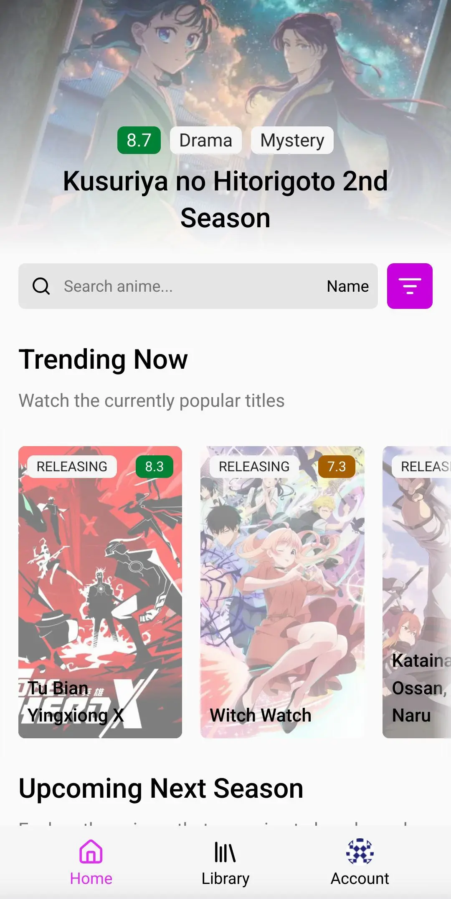

<div align="center">

<p>Looking for the previous version? Check <a href="https://github.com/notwindstone/anisun/tree/v4">v4</a> branch</p>


# [anisun (rebooted)](https://anime.tatar)

An extension-based web app for exploring anime. Written in next.js with speed in mind 

<p align="center">
<strong>English</strong> | <a href="https://github.com/notwindstone/anisun/blob/main/docs/README_russian.md">Русский</a>
</p>

[](https://github.com/notwindstone/Anisun/stargazers)

</div>

## 📱 Screenshots

<div align="center">



</div>

### More screenshots

<details>
<summary>Expand</summary>

<div align="center">
</div>

</details>

## 🧩 Extensions

* They are **not** using iframes
* Can be written in any JS framework
* Can implement their own pages
* Users don't have any extensions by default

Visit [docs.anime.tatar](https://docs.anime.tatar/) for more info.

## ⚡ Performance

* Using as few libraries as possible
* React Suspense for the seamless UI streaming
* Data caching both on the server (using [LRU cache](https://www.npmjs.com/package/quick-lru) & Next.js internal cache) and client
* Optimized [React Contexts](https://www.npmjs.com/package/use-context-selector)
* Instant user config load while SSR
* Preferring CSS over JS styles
* Memoizing only those components that truly need it
* Using Server Actions instead of API routes when possible
* Image optimization (built-in [sharp](https://www.npmjs.com/package/sharp) & specified properties) and caching for the home page
* Sidebar & mobile navbar routes prefetching 

...and a lot of other optimizations

### PageSpeed Insights

<details>
<summary>Expand</summary>

<div align="center">

</div>

</details>

### Web page size

<details>
<summary>Expand</summary>

<div align="center">

</div>

</details>

## ⭐ Features

* (WIP) Extensions
* (WIP) Seamless Anilist, Shikimori and MAL integration
* Localization
* Theme customization

## ⚙️ Tech Stack

* [Next.js 15](https://nextjs.org/) with [TypeScript](https://www.typescriptlang.org/)
* [TailwindCSS](https://tailwindcss.com/) for the UI
* An async state management using [Tanstack Query](https://tanstack.com/query/latest)
* [Mantine Hooks](https://mantine.dev/hooks/package/) for general usage on the frontend
* [Quick LRU](https://www.npmjs.com/package/quick-lru) for the in-memory cache
* OAuth2 authorization using [arctic.js](https://arcticjs.dev/)
* Extensions using [Remote Components](https://github.com/Paciolan/remote-component)

## ⬇️ Self-Hosting

### Vercel

<details>
<summary>Expand steps</summary>

Click the button

[](https://vercel.com/new/clone?s=https%3A%2F%2Fgithub.com%2Fnotwindstone%2Fanisun)

Navigate to **Project** -> **Settings** -> **Environment Variables** and then add values to the following keys:

1. `NODE_ENV` = `production`
2. `HOST_URL` = `https://your-domain-here.vercel.app`

3. (Optional) `SHIKIMORI_CLIENT_ID` = `yourOwnOAuth2ClientID` - only if you want to enable integration with Shikimori
4. (Optional) `SHIKIMORI_SECRET_KEY` = `yourOwnOAuth2SecretKey` - only if you want to enable integration with Shikimori

5. (Optional) `ANILIST_CLIENT_ID` = `yourOwnOAuth2ClientID` - only if you want to enable integration with Anilist
6. (Optional) `ANILIST_SECRET_KEY` = `yourOwnOAuth2SecretKey` - only if you want to enable integration with Anilist

7. (Optional) `MAL_CLIENT_ID` = `yourOwnOAuth2ClientID` - only if you want to enable integration with MyAnimeList
8. (Optional) `MAL_SECRET_KEY` = `yourOwnOAuth2SecretKey` - only if you want to enable integration with MyAnimeList

Note: LRU cache might not work as expected, because serverless environments tend to spin down on low load.

</details>

### Local

<details>
<summary>Expand steps</summary>

If you don't want to use a vercel/netlify/other serverless environment.

#### Preparations

You need to install:

- Node.js
- A package manager for node.js (e.g. [bun](https://bun.sh/))
- Git

After successful installation clone this repository by running:

```bash
git clone https://github.com/notwindstone/anisun
```

Now you can install all project dependencies with `bun i`

#### Development

You can run this app in development mode using `bun dev`

It will be much slower than the production build, because development mode is intended to use only for development, it builds everything on-demand and supports Hot Module Replacement (HMR).

#### Termux

To run this project in development mode, use `bun run dev:termux`

#### Production

Build this app by running `bun run build`

Now you can start it by `bun run start`

But it is not production-ready yet. You need to install a reverse-proxy like Caddy first.

After you have installed Caddy, you need to rename `Caddyfile.example` in the root of repository to `Caddyfile` and change `example.com` in the file to your domain (`anime.tatar` in my case). Then just restart it by running `caddy stop` and `caddy start` in the terminal.

Be sure you are running `caddy start` in the repository directory, otherwise Caddy will not use your configuration file.

With Caddy you can also use a Cloudflare proxied DNS for DDoS protection, you just need to set `SSL/TLS` encryption mode to `Full (Strict)` and point A-record to your host machine IP.

</details>

## 🤝 Contributing

Contributions are welcome! Check [CONTRIBUTING.md](CONTRIBUTING.md)

## 💬 Contact

### Directly

* [Telegram - @windst1](https://t.me/windst1)
* [Discord - @notwindstone](https://discord.com/users/510709295814279168)

### Through our Discord server

* [Discord - department of type safety](https://discord.gg/JhmkZDScfg)

## ⭐️ Star History

[](https://star-history.com/#notwindstone/anisun&Date)

## ❤️ Credits

* [zvshka](https://github.com/zvshka) for his help with the project
* `cos` for his help with the UI
* [Anilist API](https://docs.anilist.co/)
* [MyAnimeList API](https://myanimelist.net/apiconfig/references/api/v2)
* [Shikimori API](https://shikimori.one/api/doc/graphql)

## 📜 License

[](https://github.com/notwindstone/Anisun/blob/main/LICENSE)

## ❗ Disclaimer

> [!IMPORTANT]
> The developer of this application does not have any affiliation with the content providers available, and this application hosts zero content.

## some shit that i will remove later

why tf webpack microfrontend module federation runtime is so complicated bruuh. i managed to implement remote loading simple react component, but i cant fucking use any react hooks and i don't know what to do with this shit

i also tried [importmaps](https://www.mercedes-benz.io/blog/2023-01-05-you-might-not-need-module-federation-orchestrate-your-microfrontends-at-runtime-with-import-maps) but it didn't really work. maybe i should figure out what exactly should i pass as a file, because i just passed a transpiled react code

[@paciolan/remote-component](https://www.npmjs.com/package/@paciolan/remote-component) was easy to setup and use, i managed to use not only built-in react hooks, but even some packages from npm, like lucide-react or material ui icons. tho tanstack query didn't work, because remote-component's starter kit is really outdated
// update a day later: i dropped remote-component-starter and configured building stuff from scratch and managed to make a project on react and even vue that will bundle every dependency smoothly, which will work in the project

ask about using this logo

https://x.com/ahiru_tokotoko/status/1568517301737242625

* Shikimori, MAL and AniList integrations

https://github.com/consumet/api.consumet.org
